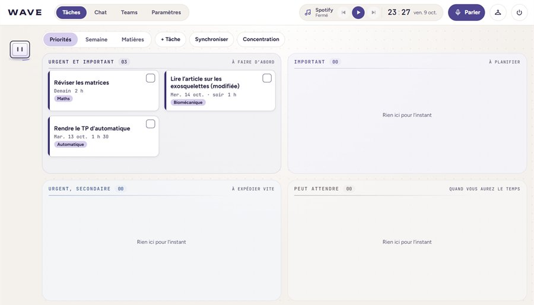
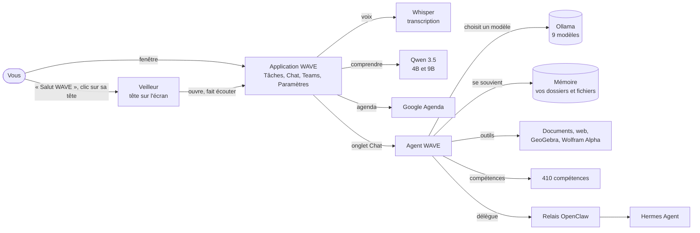
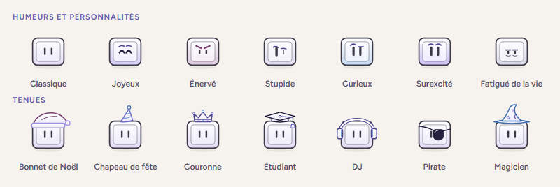
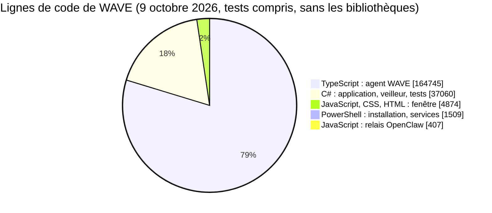

# WAVE

**L'assistant personnel qui vit sur votre ordinateur, et seulement sur lui.**

Il range vos journées, vous écoute quand vous l'appelez, apprend vos cours et vos dossiers, et répond avec des IA qui
tournent sans rien envoyer en ligne.

> [!NOTE]
> **Pour l'instant, WAVE n'est pas disponible au téléchargement.** Il est développé et utilisé chaque jour sur un seul
> ordinateur, le temps d'être fiable partout. Ce dépôt présente WAVE et son fonctionnement : il ne contient aucun code.

## Sommaire

- [Ce que WAVE change au quotidien](#ce-que-wave-change-au-quotidien)
- [Une journée avec WAVE](#une-journée-avec-wave)
- [Comment WAVE fonctionne](#comment-wave-fonctionne)
- [Les langages de WAVE, et pourquoi ceux-là](#les-langages-de-wave-et-pourquoi-ceux-là)
- [Les IA de WAVE](#les-ia-de-wave)
- [Les compétences de l'agent](#les-compétences-de-lagent)
- [Vos données restent chez vous](#vos-données-restent-chez-vous)
- [Questions fréquentes](#questions-fréquentes)

## Ce que WAVE change au quotidien

| | |
| --- | --- |
| **Vos tâches se rangent seules** | Urgent, important, à planifier : WAVE classe tout, et transforme les examens et les rendus de Google Agenda et de Microsoft Teams en tâches. |
| **On lui parle** | « Salut WAVE », puis « ajoute révision de maths demain soir » : c'est dans l'agenda, et « Annuler » le retire pendant 10 secondes. |
| **Il apprend ce que vous lui donnez** | Ajoutez un dossier ou des fichiers à sa mémoire (cours, rapports, notes, code) : il les lit sur l'ordinateur et s'en sert pour vous répondre. |
| **Un vrai agent** | Il cherche sur le web, lit les PDF, Word, Excel et PowerPoint, calcule avec GeoGebra, et applique 410 méthodes de travail. |
| **Rien ne part en ligne** | Toutes ses IA tournent sur l'ordinateur ; vos données restent chez vous, chiffrées. |
| **Un compagnon sur l'écran** | Sa petite tête vit sur le bureau : 14 avatars, une balade de temps en temps, un clic pour lui parler. |

## Une journée avec WAVE

<b>Dérouler la journée</b> (cinq moments)

 

| Heure | Ce qui se passe |
| --- | --- |
| **8 h** | La tête de WAVE apparaît dans un coin de l'écran. « Salut WAVE » : la fenêtre s'ouvre, WAVE vous salue par votre surnom et rappelle l'examen de jeudi, lu dans Google Agenda. |
| **10 h** | En cours, un clic sur sa tête : « rendu du TP d'automatique mardi ». L'événement est ajouté, sans ouvrir la fenêtre. |
| **14 h** | Dans le Chat : « explique-moi le chapitre 3 de mon cours de mécanique ». L'agent retrouve le cours dans sa mémoire, l'explique pas à pas et trace la courbe avec GeoGebra. |
| **18 h** | « Mets ma playlist de révision » : Spotify démarre. |
| **22 h** | Vous fermez WAVE : il revient au centre, dit « À plus tard » et s'éteint en un point de lumière. |

## Comment WAVE fonctionne

WAVE a deux parties qui travaillent ensemble : **l'application WAVE** (la fenêtre, la voix, la tête sur l'écran) et
**l'agent WAVE** (le chat, la mémoire, les outils). Le schéma se zoome et se déplace.

<b>1. Le veilleur et la tête sur l'écran</b>

 

Un petit programme démarre avec Windows et n'écoute qu'une phrase, « Salut WAVE », avec la reconnaissance vocale de
Windows, sur l'ordinateur. Il fait aussi vivre la tête de WAVE sur l'écran :

- **14 avatars**, chacun avec sa façon d'être : le magicien fait apparaître des serpents, le pirate tire au canon sur
  les mots de l'écran, le bonnet de Noël lance des boules de neige, le DJ danse ;
- **discrète** : une balade et un effet toutes les 5 à 8 minutes en moyenne, et elle s'efface dès que la fenêtre de WAVE
  est ouverte ;
- **un clic** et WAVE écoute une demande, sans ouvrir sa fenêtre.

<b>2. L'application WAVE</b>

 

- **Les tâches et les révisions**, rangées par urgence et importance, par semaine ou par matière.
- **Google Agenda** : WAVE rappelle les examens, les rendus et les rendez-vous, et ajoute un événement dicté. Si la
  demande est claire, il l'ajoute tout de suite et « Annuler » le retire pendant 10 secondes ; sinon il attend un clic.
  Il ne modifie jamais un événement et ne supprime que ceux qu'il a ajoutés.
- **Microsoft Teams** : les tâches et les devoirs, avec une frise des dates limites.
- **La voix** : la demande est transcrite par Whisper puis comprise par un petit modèle Qwen. La musique (Spotify), les
  recherches et l'ouverture d'applications sont reconnues directement, sans IA, pour aller plus vite.
- **Les paramètres**, tous expliqués : l'état des services, les modèles d'IA et leur rôle, la mémoire, l'apparence.
- **L'onglet Chat**, qui affiche l'agent WAVE.

<b>3. L'agent WAVE</b>

 

L'agent répond dans l'onglet Chat. Pour chaque demande :

1. **il choisit le modèle** le mieux adapté (mode « Auto »), ou celui qu'on lui indique ;
2. **il cherche les compétences utiles** parmi les 410, par les mots et par le sens, puis les applique ;
3. **il utilise ses outils** : lire les documents des dossiers qu'on lui autorise, chercher sur le web, calculer avec
   GeoGebra ou Wolfram|Alpha ; il demande confirmation avant une action sensible ;
4. **il se souvient** : projets, conversations et documents appris sont retrouvés par le sens ;
5. **il délègue** si besoin à des sous-agents, ou à Hermes Agent, un second agent installé sur l'ordinateur.

<b>4. La mémoire de WAVE, à votre mesure</b>

 

Dans **Paramètres, Mémoire de WAVE**, on choisit ce que WAVE doit apprendre :

- **un dossier entier**, avec ses sous-dossiers (un cours, un projet, un stage) ;
- **des fichiers un par un**, copiés dans un dossier « Mémoire de WAVE » ;
- Word, PowerPoint, Excel, PDF, notes, pages web, tableaux et code sont lus ; Windows et les données des applications
  restent toujours hors de portée.

WAVE les lit sur l'ordinateur, en retient le sens et les relit toutes les 30 minutes. « Retirer » lui fait oublier un
dossier sans toucher aux fichiers.

## Les langages de WAVE, et pourquoi ceux-là

Chaque partie de WAVE est écrite dans le langage qui fait le mieux son travail.

| Langage | Où dans WAVE | Pourquoi ce choix |
| --- | --- | --- |
| **C#** (.NET 10) | L'application, le veilleur et sa tête, les connexions à Google et Microsoft, les 1 193 tests | Le langage natif de Windows : accès direct à la reconnaissance vocale, au chiffrement de Windows, aux fenêtres transparentes et à l'automatisation des applications. Rapide, et typé : beaucoup d'erreurs sont trouvées avant même de lancer WAVE. Les bibliothèques officielles de Google et de Microsoft existent en C#. |
| **WPF, WinForms et GDI+** | La fenêtre (WPF) ; la tête sur l'écran, dessinée image par image (WinForms et GDI+) | Les outils d'interface de .NET : une fenêtre moderne d'un côté, une fenêtre transparente et légère, au-dessus de tout, de l'autre. |
| **HTML, CSS et JavaScript** | L'intérieur de la fenêtre (affiché par WebView2), les avatars et les animations | Les animations sont plus fluides et plus simples à créer en CSS et en SVG. Un seul dessin des avatars sert partout. Aucune bibliothèque : la fenêtre s'ouvre tout de suite, même hors ligne. |
| **TypeScript** (Node.js et React) | L'agent WAVE : le serveur (Express, SQLite) et le chat (React, Vite) | Le monde des IA parle surtout ce langage : Ollama, lecture des PDF et documents Office, formules, schémas. TypeScript ajoute des types à JavaScript, donc moins d'erreurs ; le même langage sert au serveur et au chat. L'agent est construit à partir de [FreeLLMAPI](https://github.com/tashfeenahmed/freellmapi), un routeur d'IA libre (licence MIT). |
| **SQL** (SQLite) | Les données : base chiffrée de l'application, mémoire de l'agent avec recherche plein texte | Un seul fichier, aucun serveur à installer, très rapide. |
| **PowerShell** | L'installation, les mises à jour, le démarrage des services | Il est intégré à Windows : rien à installer en plus. |

<b>Pourquoi pas un seul langage pour tout ?</b>

 

- **Tout en C# ?** L'agent aurait dû refaire ce que l'écosystème TypeScript offre déjà pour les IA : la lecture des
  documents, l'affichage des réponses (formules, schémas, code) et le routage entre modèles.
- **Tout en TypeScript ?** La voix sur la carte graphique, le chiffrement de Windows et la tête qui vit au-dessus des
  fenêtres demandent un langage natif de Windows ; une application Electron aurait aussi été plus lourde.
- **Python ?** Il aurait fallu installer et maintenir un interpréteur, avec un démarrage plus lent. Python sert seulement
  à Hermes Agent, un second agent installé à côté de WAVE.

## Les IA de WAVE

Tous les modèles tournent **sur l'ordinateur** avec [Ollama](https://ollama.com) : aucune conversation n'est envoyée à
une IA en ligne. Matériel : PC Windows 11, 32 Go de mémoire vive, carte NVIDIA RTX 2000 Ada (8 Go).

<b>Les 9 modèles de l'agent</b>

 

| Modèle | Particularité | Contexte | Images | Outils | Taille |
| --- | --- | --- | --- | --- | --- |
| Gemma 4 26B | Mixture d'experts : 4 milliards de paramètres actifs, rapide pour sa taille | 32 000 jetons | oui | oui | 14,6 Go |
| Qwen 3.8 27B | 27 milliards de paramètres | 32 000 jetons | oui | oui | 16,5 Go |
| Gemma 4 31B | 31 milliards de paramètres | 32 000 jetons | oui | oui | 19,0 Go |
| Muse Glimmer 30B | Modèle de Meta | 32 000 jetons | oui | oui | 16,9 Go |
| Nemotron 3.5 Lightning 30B | Modèle de NVIDIA, texte seulement | 32 000 jetons | non | oui | 23,7 Go |
| Laguna XS 2.1 33B | Spécialisé dans le code | 32 000 jetons | non | oui | 18,9 Go |
| Qwen 3.6 35B | Mixture d'experts, le plus long contexte : pour les longs documents | 64 000 jetons | oui | oui | 21,1 Go |
| Gemma 4 E4B | Petit et rapide | 32 000 jetons | oui | oui | 5,7 Go |
| GLM-OCR | Lit les photos et les scans de documents | 32 000 jetons | oui | non | 1,5 Go |

« Images » : le modèle comprend une image jointe ; « Outils » : il peut agir (fichiers, recherche, calcul…).

<b>Les autres IA de WAVE</b>

 

| IA | Rôle |
| --- | --- |
| Qwen 3.5 4B et 9B | Comprendre les demandes dites à la voix (le 4B d'abord, le 9B en secours) |
| Qwen3 Embedding 4B | Recherche par le sens dans la mémoire, les projets et les documents |
| Whisper large-v3 (version française) | Transcrire la voix, sur la carte graphique |
| Reconnaissance vocale de Windows | Entendre « Salut WAVE » |
| Lecture de texte de Windows | Repérer les mots de l'écran pour les animations de la tête (rien n'est gardé) |

## Les compétences de l'agent

Une compétence est une méthode écrite pour un type de tâche. L'agent cherche les plus utiles à chaque demande, les lit
puis les applique ; celles qui le servent le plus remontent au fil du temps.

<b>Les 410 compétences, par origine</b>

 

| Origine | Nombre | Exemples |
| --- | --- | --- |
| Boîte à outils de développement ECC | 293 | Revue de code, tests, sécurité, architecture, bases de données, documentation |
| Hermes Agent | 52 | Recherche sur arXiv, citations sourcées, veille, diagrammes, vidéos d'explication, Obsidian, comptes rendus de réunion |
| Application Claude | 48 | Word, PowerPoint, Excel, PDF, recherche approfondie, explications « depuis zéro », électronique numérique, finance |
| Compétences personnelles | 11 | Anticipation des risques, mémoire du projet, conception de modules, vocabulaire métier, mise à l'épreuve d'un plan |
| Ponytail | 6 | Écrire le code le plus simple qui marche |

## Vos données restent chez vous

- Les données de l'application restent sur l'ordinateur, dans une base chiffrée dont la clé est protégée par Windows.
- Celles de l'agent (conversations, projets, mémoire) restent sur l'ordinateur, dans sa base locale ; ses clés d'accès y
  sont chiffrées.
- Rien n'est vendu, partagé, ni utilisé pour entraîner un modèle d'intelligence artificielle.

**Ce qui passe par Internet, et seulement quand on le demande :** les recherches sur le web (Brave Search, ou un moteur
SearXNG installé sur l'ordinateur), les calculs confiés à Wolfram|Alpha, Google Agenda, Spotify, et les tâches Microsoft
Teams (relevées une fois par semaine par une tâche planifiée de l'application Claude, puis importées dans WAVE, tant que
l'école n'autorise pas WAVE à les lire lui-même).

## Questions fréquentes

<b>Puis-je installer WAVE sur mon ordinateur ?</b>

 

Pas pour l'instant : WAVE n'est pas encore disponible au téléchargement. Il est développé et utilisé sur un seul
ordinateur ; ce dépôt sert à le présenter.

<b>Quel ordinateur faut-il ?</b>

 

WAVE tourne sur Windows 11. Les gros modèles de l'agent demandent une carte graphique NVIDIA et beaucoup de mémoire : il
est utilisé avec 32 Go de mémoire vive et une carte de 8 Go. La voix et la fenêtre, elles, se contentent de petits
modèles.

<b>WAVE marche-t-il sans Internet ?</b>

 

Oui pour l'essentiel : les tâches, la voix, la tête sur l'écran, le chat avec ses modèles et sa mémoire. Il faut
Internet seulement pour ce qui est en ligne par nature : les recherches web, Google Agenda, Teams, Spotify et
Wolfram|Alpha.

<b>Comment WAVE est-il vérifié ?</b>

 

1 193 tests automatiques, une vérification automatique de la fenêtre et du Chat en 56 étapes à chaque évolution, et un journal où
chacune des 181 décisions de conception est expliquée.

---

Dernière mise à jour : 9 octobre 2026. Ce dépôt présente WAVE ; il ne contient aucun code.
