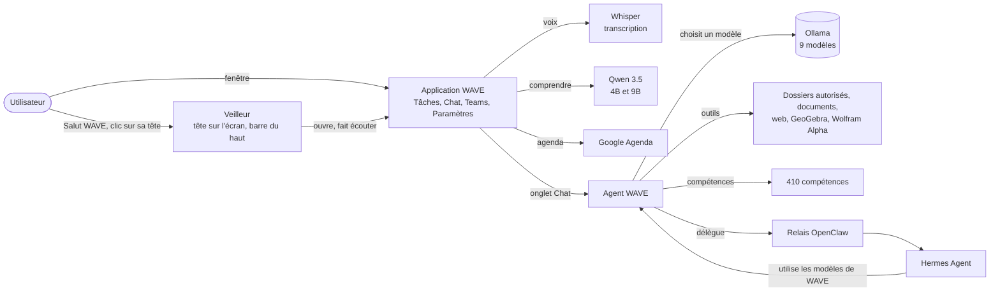

# WAVE : présentation et fonctionnement

WAVE est un assistant personnel et un agent d'intelligence artificielle pour Windows 11, développé pour un usage
personnel par un étudiant ingénieur. Ce dépôt **explique** ce qu'est WAVE et comment il fonctionne : il ne contient
aucun code. Le code de WAVE n'est pas publié et WAVE n'est pas distribué.

## En bref

- **Toute son IA tourne sur l'ordinateur** : neuf modèles pour son agent, plus ceux de la voix, avec Ollama. Aucune
  conversation n'est envoyée à une IA en ligne.
- **Deux parties qui travaillent ensemble** : l'application WAVE (la fenêtre, la voix, la petite tête sur l'écran) et
  l'agent WAVE (le chat, les projets, la mémoire, les outils).
- **410 compétences** que l'agent choisit et applique selon la demande.
- **Prudent par conception** : il demande confirmation avant les actions sensibles, ses données restent sur
  l'ordinateur, et chaque choix de conception est noté dans un journal des décisions (179 décisions à ce jour).

## Comment WAVE fonctionne

### 1. Le veilleur et la petite tête sur l'écran

Un petit programme démarre avec Windows et écoute seulement la phrase « Salut WAVE », avec la reconnaissance vocale de
Windows, sur l'ordinateur. Il montre aussi la tête de WAVE, qui vit sur l'écran comme un personnage :

- **elle change de tenue et d'humeur** : 14 avatars, chacun avec sa façon d'être (le magicien lance un sort, le pirate
  tire au canon sur les mots de l'écran, le DJ danse…) ;
- **elle se balade** une fois toutes les 5 à 8 minutes, et s'efface dès que l'application WAVE est ouverte ;
- **un clic** et WAVE écoute une demande, sans ouvrir sa fenêtre ; **un double clic** montre la barre du haut, d'où on
  peut écrire ou parler à WAVE.

### 2. L'application WAVE

La fenêtre de WAVE (Windows) réunit :

- **les tâches et les révisions**, rangées par urgence et importance ;
- **Google Agenda** : WAVE rappelle les examens, les rendus et les rendez-vous, et ajoute un événement dicté. Si la
  demande est claire, il l'ajoute tout de suite et « Annuler » le retire pendant 10 secondes ; sinon il attend un clic.
  Il ne modifie jamais un événement et ne supprime que ceux qu'il a ajoutés ;
- **Microsoft Teams** : les tâches et les devoirs, avec une frise des dates limites ;
- **la voix** : la demande est transcrite par Whisper, puis comprise par un petit modèle Qwen. La musique (Spotify), les
  recherches et l'ouverture d'applications sont reconnues directement, sans IA, pour aller plus vite ;
- **l'onglet Chat**, qui affiche l'agent WAVE.

À l'ouverture comme à la fermeture, une courte animation montre WAVE au centre de figures lumineuses.

### 3. L'agent WAVE

L'agent répond dans l'onglet Chat. Pour chaque demande :

1. **il choisit le modèle** le mieux adapté (mode « Auto »), ou celui qu'on lui indique ;
2. **il cherche les compétences utiles** parmi les 410, par les mots et par le sens, puis les applique ;
3. **il utilise ses outils** : lire les documents des dossiers qu'on lui autorise, chercher sur le web, calculer avec
   GeoGebra ou Wolfram|Alpha ; il demande confirmation avant une action sensible ;
4. **il se souvient** : projets, mémoire et documents appris sont retrouvés par le sens ;
5. **il délègue** si besoin à des sous-agents, ou à Hermes Agent (un second agent installé sur l'ordinateur, qui utilise
   lui aussi les modèles de WAVE).

## Les IA de WAVE

Matériel : PC Windows 11, 32 Go de mémoire vive, carte NVIDIA RTX 2000 Ada (8 Go).

### Les modèles de l'agent

| Modèle | Particularité | Contexte | Images | Outils | Taille |
| --- | --- | --- | --- | --- | --- |
| Gemma 4 26B | Mixture d'experts : 4 milliards de paramètres actifs, rapide pour sa taille | 32 000 jetons | oui | oui | 14,6 Go |
| Qwen 3.8 27B | 27 milliards de paramètres | 32 000 jetons | oui | oui | 16,5 Go |
| Gemma 4 31B | 31 milliards de paramètres | 32 000 jetons | oui | oui | 19,0 Go |
| Muse Glimmer 30B | Modèle de Meta | 32 000 jetons | oui | oui | 16,9 Go |
| Nemotron 3.5 Lightning 30B | Modèle de NVIDIA, texte seulement | 32 000 jetons | non | oui | 23,7 Go |
| Laguna XS 2.1 33B | Spécialisé dans le code | 32 000 jetons | non | oui | 18,9 Go |
| Qwen 3.6 35B | Mixture d'experts, le plus long contexte : pour les longs documents | 64 000 jetons | oui | oui | 21,1 Go |
| Gemma 4 E4B | Petit et rapide | 32 000 jetons | oui | oui | 5,7 Go |
| GLM-OCR | Lit les photos et les scans de documents | 32 000 jetons | oui | non | 1,5 Go |

« Images » : le modèle comprend une image jointe ; « Outils » : il peut agir (fichiers, recherche, calcul…).

### Les autres IA de WAVE

| IA | Rôle |
| --- | --- |
| Qwen 3.5 4B et 9B | Comprendre les demandes dites à la voix (le 4B d'abord, le 9B en secours) |
| Qwen3 Embedding 4B | Recherche par le sens dans la mémoire, les projets et les documents |
| Whisper large-v3 (version française) | Transcrire la voix, sur la carte graphique |
| Reconnaissance vocale de Windows | Entendre « Salut WAVE » |
| Lecture de texte de Windows | Repérer les mots de l'écran pour les animations de la tête (rien n'est gardé) |

## Les compétences de l'agent : 410

Une compétence est une méthode écrite pour un type de tâche. L'agent cherche les plus utiles à chaque demande, les lit
puis les applique ; celles qui le servent le plus remontent au fil du temps.

| Origine | Nombre | Exemples |
| --- | --- | --- |
| Boîte à outils de développement ECC | 293 | Revue de code, tests, sécurité, architecture, bases de données, documentation |
| Hermes Agent | 52 | Recherche sur arXiv, citations sourcées, veille, diagrammes, vidéos d'explication, Obsidian, comptes rendus de réunion |
| Application Claude | 48 | Word, PowerPoint, Excel, PDF, recherche approfondie, explications « depuis zéro », électronique numérique, finance |
| Compétences personnelles | 11 | Anticipation des risques, mémoire du projet, conception de modules, vocabulaire métier, mise à l'épreuve d'un plan |
| Ponytail | 6 | Écrire le code le plus simple qui marche |

## Ce qui passe par Internet, et seulement quand on le demande

- les recherches sur le web (Brave Search, ou un moteur SearXNG installé sur l'ordinateur) ;
- les calculs confiés à Wolfram|Alpha ;
- Google Agenda ;
- les tâches Microsoft Teams : relevées une fois par semaine par une tâche planifiée de l'application Claude, puis
  importées dans WAVE, tant que l'école n'autorise pas WAVE à les lire lui-même ;
- Spotify, pour la musique.

## Les données

- Celles de l'application WAVE restent sur l'ordinateur, chiffrées (base chiffrée, clé protégée par Windows).
- Celles de l'agent (conversations, projets, mémoire) restent sur l'ordinateur, dans sa base locale ; ses clés d'accès
  y sont chiffrées.
- Rien n'est vendu, partagé, ni utilisé pour entraîner un modèle d'intelligence artificielle.

Dernière mise à jour : 9 octobre 2026.
